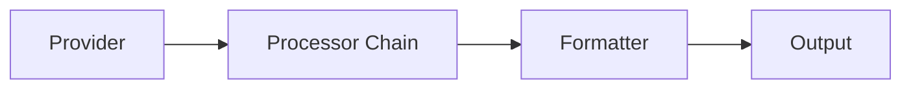

# Architecture Documentation

## Overview

**go-report-engine** is designed as a modular, extensible pipeline for data processing. It adheres to **SOLID principles** and uses established design patterns to ensure maintainability and testability.

## Core Concepts

The engine operates as a sequential pipeline:

### 1. Provider (Source)
- **Role**: Fetch data from an external source.
- **Interface**: `provider.ProviderStrategy`
- **Responsibilities**:
    - Connect to data source (DB, API, File).
    - Fetch data as `[]map[string]interface{}` (Batch) or `provider.Iterator` (Stream).
    - Map external schema to internal representation.

### 2. Processor (Transformation)
- **Role**: Transform, validate, or filter data.
- **Interface**: `processor.ProcessorHandler`
- **Pattern**: Chain of Responsibility.
- **Mechanism**:
    - Each processor receives a row and returns a modified row (or error).
    - Processors can be chained: `Filter -> Transform -> Validate`.
    - Supports concurrent execution via worker pools.

### 3. Formatter (Presentation)
- **Role**: Convert internal data structure to a specific format.
- **Interface**: `formatter.FormatStrategy`
- **Responsibilities**:
    - Take `[]map[string]interface{}`.
    - Serialize into bytes (JSON, CSV, YAML, etc.).
    - Handle encoding details.

### 4. Output (Destination)
- **Role**: Deliver the formatted report.
- **Interface**: `output.OutputStrategy`
- **Responsibilities**:
    - Write bytes to destination (Console, File, S3, Email).
    - Handle connection details and retries.

## Design Patterns

-   **Strategy Pattern**: Defines interfaces for Provider, Formatter, and Output, allowing interchangeable implementations.
-   **Builder Pattern**: `EngineBuilder` provides a fluent API for constructing the engine with validation.
-   **Factory Pattern**: `factory` package simplifies creation of components from configuration strings.
-   **Chain of Responsibility**: `ProcessorChain` allows sequential application of multiple processing steps.
-   **Template Method**: Abstract base classes (e.g., `BaseProcessor`) define the skeleton of an operation.
-   **Decorator Pattern**: Used for cross-cutting concerns like Metrics, Tracing, Retry, and Circuit Breakers.

## Concurrency Model

-   **Thread Safety**: Registries (`registry` package) use `sync.RWMutex` to allow concurrent reading and safe writing of component definitions.
-   **Parallel Processing**: The engine supports parallel processing of rows using worker pools to control concurrency.
-   **Streaming**: Large datasets are processed using channels and iterators to maintain constant memory usage.

## Error Handling

The engine uses a hierarchical error system defined in `internal/errors`:
-   **Classification**: Errors are typed (Transient, Permanent, Configuration, etc.).
-   **Context**: Errors carry structured context (Component, Operation, Parameters).
-   **Resilience**: Transient errors trigger automatic retries; Permanent errors fail fast.

## Observability

-   **Logging**: Structured logging via `log/slog`.
-   **Metrics**: `MetricsCollector` interface for counters, gauges, and histograms.
-   **Tracing**: `Tracer` interface for distributed tracing spans.
-   **Health**: `Checker` interface for component health status.
